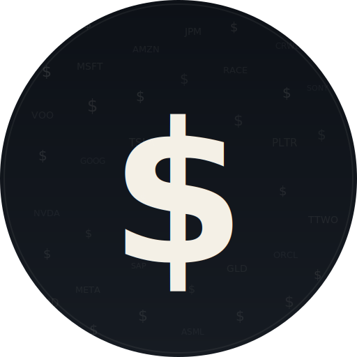

<p align="center">
  
</p>

<h1 align="center">InvestAI</h1>

<p align="center">AI-powered personal investing assistant. Analyze stocks, review portfolios, and get market insights — all in a single HTML file.</p>

Runs entirely in your browser. No server needed.

**[Live Demo](https://potuzhnyj.github.io/InvestAI/)**

## Features

- **AI Chat** — streaming responses with markdown, tables, and code highlighting
- **Real-Time Data** — Google Search grounding gives the AI access to live stock prices, news, and earnings
- **Image Analysis** — paste, upload, or drag & drop charts and financial screenshots
- **Portfolio Management** — side panel to view, add, and remove holdings
- **Portfolio-Aware AI** — the assistant knows your actual positions and gives concrete analysis
- **Auto Price Lookup** — add a holding without a price and Gemini fetches the current price automatically
- **Import / Export** — load a `portfolio.json` file or export your holdings
- **Dark / Light Themes** — animated gradient backgrounds, preference saved
- **Chat Persistence** — conversations saved to localStorage, AI retains context after reload
- **Export Chat** — download chat history as `.txt`
- **Text-to-Speech** — "Read" button on every AI response reads it aloud
- **Mobile Responsive** — 4 breakpoints (768 / 480 / 360px), full-screen portfolio overlay, safe-area support for notched phones
- **Accessible** — skip link, focus outlines, ARIA labels & roles, aria-live regions, Escape to close, reduced-motion support, screen reader friendly
- **Zero Backend** — everything runs client-side, your API key never leaves your browser

## Setup

1. Get a free Gemini API key at [aistudio.google.com/apikey](https://aistudio.google.com/apikey)
2. Open `index.html` via a local server (see below) or visit the GitHub Pages link
3. Paste your API key when prompted
4. Start chatting

### Run locally

The app uses ES modules (CDN imports), so it must be served over HTTP — not opened as a `file://` URL.

```bash
# Any of these work:
python3 -m http.server 8080
# or
npx serve .
```

Then open [http://localhost:8080](http://localhost:8080)

### Free tier limits

The Gemini free tier has daily request quotas (e.g. 20 requests/day). If you hit the limit, wait a minute and try again.

## Deploy to GitHub Pages

```bash
git clone <repo-url>
cd InvestAI
```

Then in your GitHub repo settings:
1. Go to **Settings** > **Pages**
2. Source: **Deploy from a branch**
3. Branch: **main**, folder: **/ (root)**
4. Save — your site will be live at `https://<username>.github.io/InvestAI/`

## Portfolio

Your portfolio is stored in your browser's localStorage. You can:

- Add holdings through the side panel (price auto-filled by AI if left empty)
- **Import**: click "Import JSON" to load a `portfolio.json` file
- **Export**: click "Export JSON" to download your current portfolio
- The AI references your holdings when you ask about "my portfolio"

### Portfolio JSON format

```json
{
  "currency": "USD",
  "risk_tolerance": "moderate",
  "cash_available": 0,
  "holdings": [
    { "ticker": "AAPL", "shares": 10, "avg_price": 150, "notes": "Core holding" }
  ],
  "non_stock_holdings": [
    { "name": "Bitcoin", "amount": 0.5, "avg_price": 40000, "notes": "Crypto" }
  ]
}
```

## Accessibility

- **Keyboard**: Tab through all controls, Enter to send, Escape closes portfolio panel
- **Screen readers**: ARIA labels on all buttons, `aria-live` regions for AI responses and thinking indicator
- **Skip link**: Tab on page load to jump straight to the chat input
- **Reduced motion**: Respects `prefers-reduced-motion` OS setting
- **Text-to-Speech**: Built-in read-aloud button on every AI response (uses browser SpeechSynthesis API)
- **Focus outlines**: Visible focus ring on all interactive elements
- **Touch targets**: Minimum 44px on mobile (WCAG 2.1)
- **Color contrast**: WCAG AA compliant

## Tech Stack

| Layer      | Tech                                                     |
|------------|----------------------------------------------------------|
| AI         | Google Gemini 3 Flash via browser SDK                    |
| Search     | Google Search grounding for real-time market data        |
| Frontend   | Vanilla HTML / CSS / JS (single file)                    |
| Markdown   | marked.js + DOMPurify + highlight.js                     |
| TTS        | Web SpeechSynthesis API                                  |
| Storage    | localStorage (portfolio + chat + theme + API key)        |
| Hosting    | GitHub Pages (static)                                    |

## Project Structure

```
├── index.html       # The entire app (~2440 lines)
├── logo.svg         # Project logo
├── portfolio.json   # Sample portfolio for import
├── README.md
├── LICENSE
└── .gitignore
```

## Built With

This project was built with the help of **Claude** (Anthropic) for code generation and development assistance, and powered by the **Google Gemini API** for AI chat functionality.

## License

MIT
